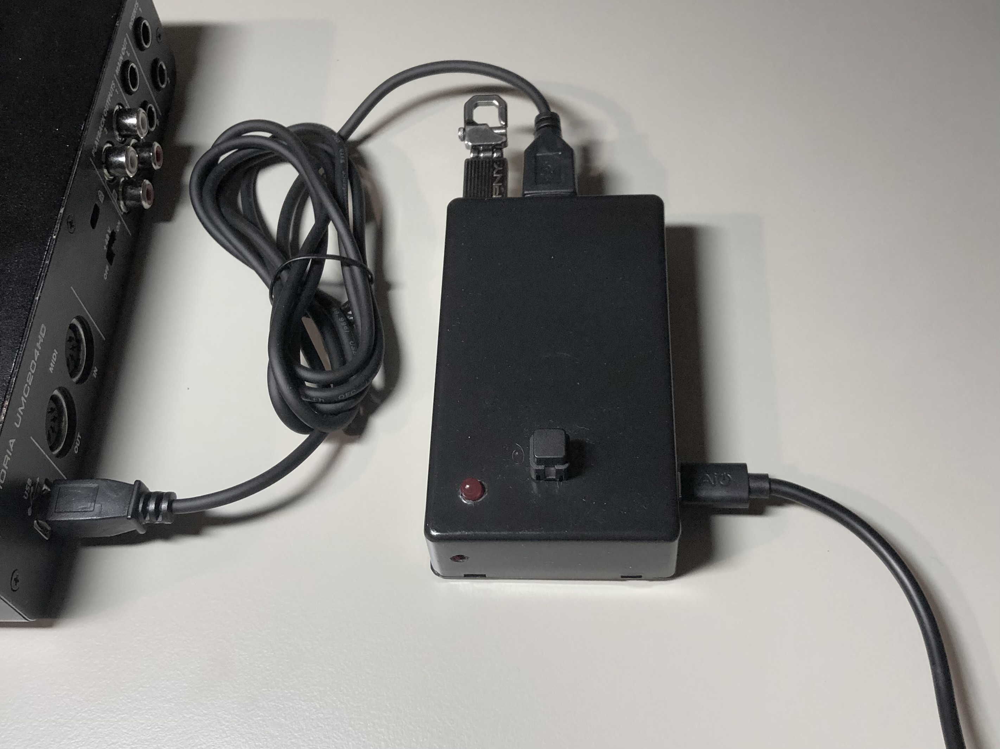

# GRABADORA "CAJA NEGRA"

Grabadora caja negra, ideada para grabar un evento sonorizado con una mesa de mezclas con interfaz de audio USB.

También se puede usar por ejemplo conectándole cualquier interfaz de audio (tarjeta de sonido) USB y algún micrófono.

La interfaz de usuario consiste en un sencillo pulsador y un LED indicador del estado de la grabadora.

Las pistas de audio quedan almacenadas en un PINCHO USB de memoria, con un nombre de archivo secuencial con la fecha y hora de inicio.

  

  

